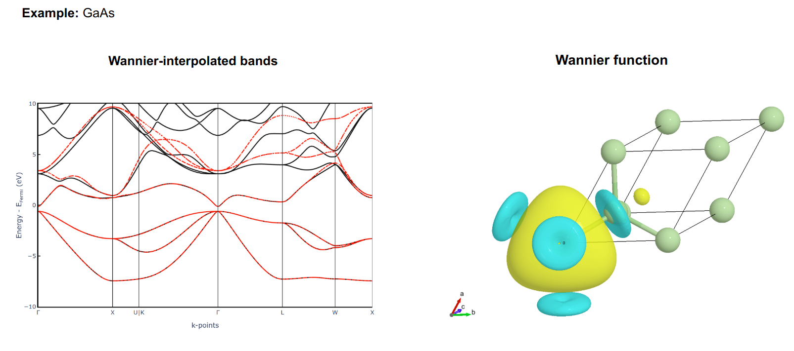

# aiidalab-qe-wannier90

Lightweight integration to run Wannier90 workflows within the AiiDAlab Quantum ESPRESSO application.

## Key features

- Band-structure comparison against DFT results.
- Predefined protocols: `fast`, `balanced`, `stringent`.
- Export and visualize real-space Wannier functions (isosurfaces / 3D meshes).



## Quickstart

Prerequisites: an AiiDA profile with Quantum ESPRESSO and Wannier90 available.

Install from the repository root (editable install recommended for development):

```bash
pip install -e .
```

Validate a local Wannier90 installation:

```bash
./wannier90.x -h
```

## Usage

The primary entrypoint is the AiiDAlab QE App GUI — run workflows and view results there. For isosurface workflows the package can produce mesh data as AiiDA output nodes that are then visualized in the AiiDAlab front-end, avoiding large file downloads.

## PythonJob isosurface helper

To compute and export isosurface meshes using a `pythonjob` calculation, install the required Python packages in the environment used by the code:

```bash
pip install cloudpickle scikit-image ase
```

Example `pythonjob` configuration (adjust `filepath_executable` and modules to your system):

```yaml
---
label: python3
description: python3.9
default_calc_job_plugin: pythonjob.pythonjob
filepath_executable: /path/to/python
prepend_text: |
    module purge
    module load Python/3.9
append_text: ''
```

Create the AiiDA code using `verdi` (example):

```bash
verdi code create core.code.installed --config pythonjob-code.yaml
```

## Citation

If you use this app in published work, please cite:

Wang, X., Bainglass, E., Bonacci, M., Ortega-Guerrero, A. et al. Making atomistic materials calculations accessible with the AiiDAlab Quantum ESPRESSO app. _npj Comput. Mater._ **12**, 72 (2026). https://doi.org/10.1038/s41524-025-01936-4

## License

See the repository `LICENSE` for license details.

## Contributing

Issues and pull requests are welcome. For development, run tests (if present) and open a PR with a clear summary of changes.

---
Updated README: clearer quickstart, fixed typos, and improved PythonJob instructions.
